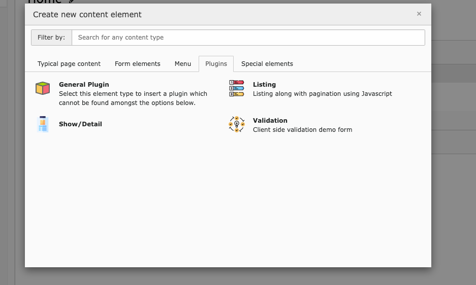
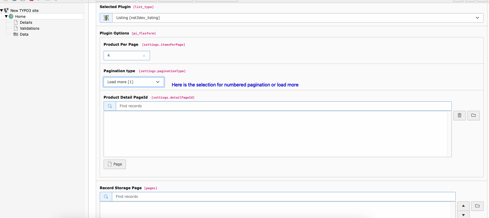

# Fronted CRUD Opeation

* #### Listing
  * The listing feature of this TYPO3 extension allows users to view records in a user-friendly manner directly from the frontend. Two distinct approaches are employed for presenting records: Pagination and Load More.

    ###### Numbered Pagination
      1. Records are organized into pages, and users can navigate through these pages using numbered pagination links.
      2. JavaScript is utilized to dynamically load and display the relevant set of records for each page without refreshing the entire page.

    ###### Load More
    Load More provides a continuous scroll experience, where additional records are loaded as the user scrolls down the page.

    ###### Implementation
    ```
    public function listAction(): \Psr\Http\Message\ResponseInterface
    {
        $productAreas = $this->productAreaRepository->findAll();
        $currentPage = $this->request->hasArgument('currentPage')
            ? (int)$this->request->getArgument('currentPage')
            : 1;
        $itemsPerPage = $this->settings['itemsPerPage'] ? $this->settings['itemsPerPage'] : 5;
        $maximumLinks = 15;
        $paginator = new QueryResultPaginator($productAreas,$currentPage,intval($itemsPerPage));
        $pagination = new SimplePagination($paginator,$maximumLinks);
        $this->view->assign(
            'pagination',
            [
                'pagination' => $pagination,
                'paginator' => $paginator,
            ]
        );
        $this->view->assign('productAreas', $productAreas);
        return $this->htmlResponse();
    }
    ```


---


