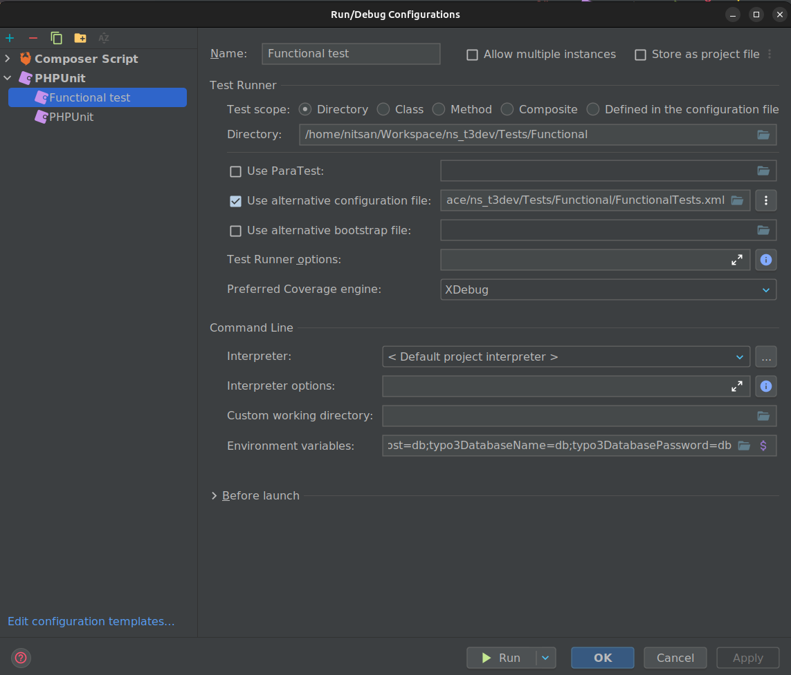

# TYPO3 Unit Testing:

* There are certain areas that scream to be unit tested:
* You're writing a method that does some PHP array munging or sorting, juggling keys and values around? Unit test this!
* You're writing something that involves date calculations? No way to get that right without unit testing!
* You're throwing a regex at some string? The unit test data provider should already exist before you start with implementing the method!

> This is an important rule in testing:
Keep tests as simple as possible! Tests should be easy to write, understand, read and refactor.


> Note: Use your extension's local path instead of `/home/nitsan/Workspace/ns_t3dev` in this location.

---
Running unit and functional tests without PHPStorm
=============================================
For Unit test:
```sh
/bin/php /home/nitsan/Workspace/ns_t3dev/.Build/vendor/phpunit/phpunit/phpunit --configuration /home/nitsan/Workspace/ns_t3dev/Tests/Unit/UnitTests.xml /home/nitsan/Workspace/ns_t3dev/Tests/Unit
```

For Functional test:
```sh
/bin/php /home/nitsan/Workspace/ns_t3dev/.Build/vendor/phpunit/phpunit/phpunit --configuration /home/nitsan/Workspace/ns_t3dev/Tests/Functional/FunctionalTests.xml /home/nitsan/Workspace/ns_t3dev/Tests/Functional
```
---
Running unit and functional tests in PHPStorm
=============================================

General setup
-------------

-  Open :guilabel:`File > Settings > PHP > Test Frameworks`.
-  (*) Use Composer autoloader.
-  Path to script: select `/home/nitsan/Workspace/ns_t3dev/.Build/vendor/autoload.php` in your project folder.

In the Run configurations, edit the PHPUnit configuration and use these
settings so this configuration can serve as a template:

-  Directory: use the `/home/nitsan/Workspace/ns_t3dev/Tests/Unit` directory in your project.
-  (*) Use alternative configuration file. select
-  Use `/home/nitsan/Workspace/ns_t3dev/Tests/Unit/UnitTests.xml`
   in your project folder.
-  Add the following environment variables:

    -  typo3DatabaseUsername
    -  typo3DatabasePassword
    -  typo3DatabaseHost
    -  typo3DatabaseName

Unit tests configuration
------------------------

In the Run configurations, copy the PHPUnit configuration and use these
settings:

-  Directory: use the `/home/nitsan/Workspace/ns_t3dev/Tests/Unit` directory in your project

Functional tests configuration
------------------------------

In the Run configurations, copy the PHPUnit configuration and use these
settings:

-  Directory: use the `/home/nitsan/Workspace/ns_t3dev/Tests/Unit/Functional` directory in your project.
-  (*) Use alternative configuration file.
-  Use
   `.Build/vendor/typo3/testing-framework/Resources/Core/Build/FunctionalTests.xml`.

---------------------------------------------------------
### Image references for configuration:



