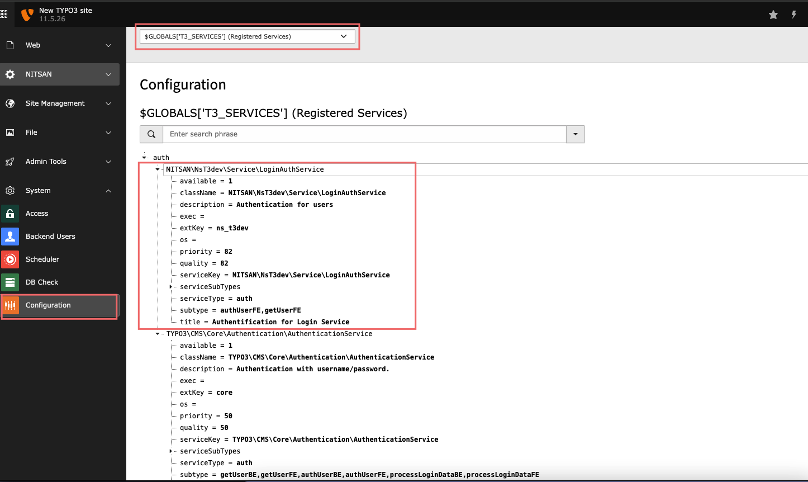

# Services
* The whole Services API works as a registry.
* Services are registered with a number of parameters, and each service can easily be overridden by another one with improved features or more specific capabilities.
* Services provide the flexibility needed for such a complex process of authentication.
* Services are PHP classes packaged inside an extension.
* Extension management class contains three methods related to services: addService, findService and deactivateService. In the detail you can check at https://docs.typo3.org/m/typo3/reference-coreapi/11.5/en-us/ApiOverview/Services/Developer/ServiceRelatedApi.html#services-api

Services parameters description
-------------
* In the example, find below key or comment and at that place add your respected data.
-  `// Extension Key` : The key of the your extension and it is a string format.
-  `// Service type` : Service type of your service and it is a string format.
-  `// Service key` : Unique Key of your Service and it is a string format.
* Then, puts the Additional information about the service it contains:
    -  `title` : Title of your service.
    -  `description` : Description of your service.
    -  `priority` : (integer) The priority of the service. A service of higher priority will be selected first. You can Use a value from 0 to 100.
    - `quality` : Integer and float value can be used. Among services with the same priority, the service with the highest quality but the same priority will be preferred.Same as the priority parameter default range is 0-100 and default value for a normal(good)quality service is 50.
    - `className`: (string) Name of the PHP class implementing the service.
* You can check in detail documentation at https://docs.typo3.org/m/typo3/reference-coreapi/11.5/en-us/ApiOverview/Services/Developer/Implementing.html#service-registration

---
How to register and implement a service
=============================================
* The class file for your service should be located in the `Classes/Service` directory.
* You must register your service in the extension's `ext_localconf.php` file.
* A service is registered with TYPO3 by calling `\TYPO3\CMS\Core\Utility\ExtensionManagementUtility::addService()`. [For example](https://github.com/nitsan-technologies/ns_t3dev/blob/main/ext_localconf.php#L69)

---------------------------------------------------------
### Image reference:
* If you want to see the your service has been registered or not then you can check with below reference image.

